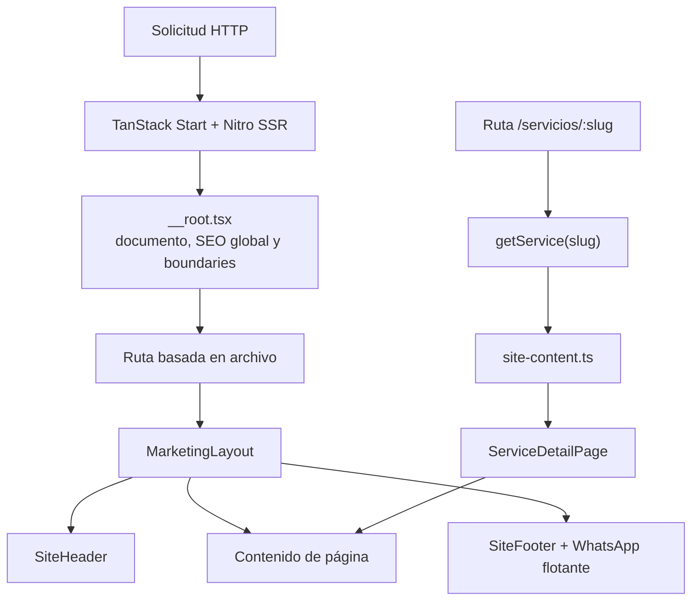

# Landing de Alianza F1

Sitio web comercial de Alianza F1 construido como una aplicación multipágina con renderizado del
lado del servidor. Presenta al **Agente IA empresarial** como producto insignia y organiza el resto
del portafolio en páginas dedicadas para software, automatización, integraciones, modernización,
infraestructura y sitios web.

El proyecto está orientado a:

- explicar la propuesta de valor de Alianza F1 con contenido HTML indexable;
- convertir visitas en conversaciones comerciales por WhatsApp;
- permitir que cada servicio tenga una URL, contenido y metadatos propios;
- mantener una navegación coherente entre la portada, el producto y los servicios;
- ofrecer una experiencia accesible, rápida y adaptable a móvil.

## Contenido

- [Alcance funcional](#alcance-funcional)
- [Tecnologías](#tecnologías)
- [Requisitos y ejecución local](#requisitos-y-ejecución-local)
- [Arquitectura](#arquitectura)
- [Estructura de directorios](#estructura-de-directorios)
- [Mapa de rutas](#mapa-de-rutas)
- [Componentes y responsabilidades](#componentes-y-responsabilidades)
- [Modelo de contenido](#modelo-de-contenido)
- [Sistema visual y movimiento](#sistema-visual-y-movimiento)
- [Responsive y accesibilidad](#responsive-y-accesibilidad)
- [SEO y metadatos](#seo-y-metadatos)
- [Integraciones y enlaces externos](#integraciones-y-enlaces-externos)
- [SSR y manejo de errores](#ssr-y-manejo-de-errores)
- [Recursos estáticos y rendimiento](#recursos-estáticos-y-rendimiento)
- [Cómo extender el sitio](#cómo-extender-el-sitio)
- [Validación y calidad](#validación-y-calidad)
- [Compilación y despliegue](#compilación-y-despliegue)
- [Criterios de seguridad y contenido](#criterios-de-seguridad-y-contenido)

## Alcance funcional

### Producto insignia

La página del Agente IA comunica un producto entrenado con información empresarial autorizada,
capaz de:

- consultar conocimiento y documentos habilitados para cada organización;
- responder con contexto empresarial;
- mostrar las fuentes utilizadas;
- operar dentro de límites y permisos definidos;
- dirigir al visitante al agente público de Alianza F1 para probar la experiencia.

### Portafolio de servicios

El sitio presenta seis líneas de servicio:

1. Software empresarial a medida.
2. Automatización e inteligencia artificial.
3. Integraciones y APIs.
4. Evolución de sistemas legacy.
5. Infraestructura y operación.
6. Sitios web y experiencias digitales.

Cada línea tiene una página propia con:

- promesa principal;
- explicación del servicio;
- resultados esperados;
- capacidades;
- escenarios recomendados;
- proceso de trabajo;
- servicios relacionados;
- llamado a la acción comercial.

### Conversión comercial

La conversión principal se realiza por WhatsApp:

- los CTA generales abren una conversación preconfigurada;
- el botón flotante permanece disponible durante la navegación;
- el formulario de la portada valida los datos en el navegador y construye un mensaje de WhatsApp;
- no existe actualmente un backend de formularios ni almacenamiento de datos de prospectos.

También existen accesos externos al blog, al agente público, al correo y al portafolio de Behance.

## Tecnologías

| Área             | Tecnología                                 | Uso                                          |
| ---------------- | ------------------------------------------ | -------------------------------------------- |
| Aplicación       | React 19                                   | Componentes y estado de interfaz             |
| Framework        | TanStack Start                             | SSR, shell de aplicación y rutas             |
| Enrutamiento     | TanStack Router                            | Rutas basadas en archivos y precarga         |
| Bundler          | Vite 8                                     | Desarrollo y compilación                     |
| Servidor         | Nitro, preset `node-server`                | Salida SSR para producción                   |
| Lenguaje         | TypeScript 5                               | Tipado estricto                              |
| Estilos          | Tailwind CSS 4                             | Utilidades, responsive y tema                |
| Componentes base | Radix UI                                   | Primitivas accesibles de interfaz            |
| Iconos           | Lucide React                               | Iconografía consistente                      |
| Datos cliente    | TanStack Query                             | Contexto preparado para consultas asíncronas |
| Formularios/UI   | React Hook Form, Zod y componentes locales | Dependencias disponibles para evolución      |
| Calidad          | ESLint y Prettier                          | Análisis estático y formato                  |

La configuración de Vite proviene de `@lovable.dev/vite-tanstack-config`. Este paquete ya registra
los plugins de React, TanStack Start, Tailwind, resolución del alias `@` y Nitro. No deben agregarse
una segunda vez en `vite.config.ts`.

## Requisitos y ejecución local

### Requisitos

- Node.js 22 recomendado.
- npm 10 o una versión compatible.
- Acceso a internet para descargar dependencias y cargar Google Fonts durante la navegación.

El proyecto incluye `package-lock.json` y `bun.lock`. La compilación actual fue validada con npm.
Para evitar cambios innecesarios en los archivos de bloqueo, debe utilizarse un solo administrador
de paquetes durante cada cambio.

### Instalación

```bash
npm ci
```

Si se está actualizando intencionalmente alguna dependencia:

```bash
npm install
```

### Desarrollo

```bash
npm run dev
```

### Compilación de producción

```bash
npm run build
```

### Vista previa

```bash
npm run preview
```

### Otros comandos

```bash
npm run lint
npm run format
npm run build:dev
```

`npm run format` modifica los archivos que Prettier considere necesarios. Conviene revisar el diff
después de ejecutarlo.

## Arquitectura

La aplicación separa el contenido comercial, la presentación compartida y las páginas concretas.
Las rutas de servicios son pequeñas porque consumen un modelo central y reutilizan una sola vista
de detalle.



### Flujo de renderizado

1. TanStack Start resuelve la ruta solicitada.
2. `src/routes/__root.tsx` construye el documento HTML, registra metadatos globales y monta el
   contexto de TanStack Query.
3. La ruta aporta sus metadatos y componente.
4. Las páginas comerciales usan `MarketingLayout` para compartir navegación, footer y contacto.
5. Nitro genera la respuesta SSR y React hidrata la interfaz en el navegador.

## Estructura de directorios

```text
Landing/
├── public/                         # Imágenes, logotipo, favicon e iconos estáticos
├── src/
│   ├── components/
│   │   ├── ui/                     # Primitivas reutilizables basadas en Radix
│   │   ├── enterprise-agent-card.tsx
│   │   ├── technology-blog-card.tsx
│   │   ├── service-detail-page.tsx
│   │   └── site-chrome.tsx
│   ├── hooks/                      # Hooks compartidos
│   ├── lib/
│   │   ├── site-content.ts         # Catálogo y contenido estructurado
│   │   ├── utils.ts                # Utilidad cn() para clases CSS
│   │   └── error-*.ts              # Captura y presentación de errores SSR
│   ├── routes/
│   │   ├── __root.tsx              # Shell raíz, metadata y boundaries
│   │   ├── index.tsx               # Portada
│   │   ├── agente-ia.tsx
│   │   ├── casos.tsx
│   │   ├── metodologia.tsx
│   │   ├── nosotros.tsx
│   │   └── servicios/
│   │       ├── index.tsx
│   │       └── *.tsx               # Una ruta por línea de servicio
│   ├── routeTree.gen.ts            # Árbol de rutas generado automáticamente
│   ├── router.tsx                  # Instancia del router y QueryClient
│   ├── server.ts                   # Entrada SSR y normalización de errores 500
│   ├── start.ts                    # Middleware de solicitudes
│   └── styles.css                  # Tema, utilidades y animaciones globales
├── eslint.config.js
├── package.json
├── tsconfig.json
└── vite.config.ts
```

> `src/routeTree.gen.ts` no se edita manualmente. TanStack Router lo regenera al detectar cambios en
> `src/routes` o durante la compilación.

## Mapa de rutas

| URL                               | Archivo                                         | Función                                      |
| --------------------------------- | ----------------------------------------------- | -------------------------------------------- |
| `/`                               | `src/routes/index.tsx`                          | Portada y recorrido comercial completo       |
| `/agente-ia`                      | `src/routes/agente-ia.tsx`                      | Producto insignia y acceso al agente público |
| `/servicios/`                     | `src/routes/servicios/index.tsx`                | Catálogo general de capacidades              |
| `/servicios/software-empresarial` | `src/routes/servicios/software-empresarial.tsx` | Sistemas y aplicaciones a medida             |
| `/servicios/automatizacion-ia`    | `src/routes/servicios/automatizacion-ia.tsx`    | Automatización, IA y agentes                 |
| `/servicios/integraciones`        | `src/routes/servicios/integraciones.tsx`        | APIs, sistemas y canales conectados          |
| `/servicios/evolucion-legacy`     | `src/routes/servicios/evolucion-legacy.tsx`     | Modernización y mantenimiento                |
| `/servicios/infraestructura`      | `src/routes/servicios/infraestructura.tsx`      | Despliegue, observabilidad y operación       |
| `/servicios/sitios-web`           | `src/routes/servicios/sitios-web.tsx`           | Presencia digital y experiencias web         |
| `/casos`                          | `src/routes/casos.tsx`                          | Casos representativos anonimizados           |
| `/metodologia`                    | `src/routes/metodologia.tsx`                    | Proceso de trabajo                           |
| `/nosotros`                       | `src/routes/nosotros.tsx`                       | Perfil, enfoque y principios de Alianza F1   |

El blog y el agente público son productos externos y no forman parte del árbol de rutas local.

## Componentes y responsabilidades

### `site-chrome.tsx`

Contiene la estructura compartida del sitio:

- `SiteHeader`: navegación de escritorio, mega menú de servicios y menú móvil;
- `SiteFooter`: contacto, navegación secundaria y enlaces externos;
- `FloatingWhatsApp`: acceso persistente al canal comercial;
- `BrandCTA`: variante unificada para CTA internos y externos;
- `MarketingLayout`: composición común de header, contenido, footer y contacto flotante.

El mega menú combina enlaces destacados y agrupaciones por capacidad. Su contenido es explícito en
el componente, por lo que una nueva familia de servicios debe agregarse allí de forma intencional.

### `service-detail-page.tsx`

Implementa la plantilla común de las páginas de servicio:

- breadcrumbs;
- hero y resultado comercial;
- capacidades;
- escenarios recomendados;
- metodología;
- servicios relacionados;
- CTA final.

También exporta `ServiceIcon`, que traduce el identificador semántico de cada servicio a un icono de
Lucide.

### Cards editoriales

- `enterprise-agent-card.tsx`: presentación visual del Agente IA en la portada.
- `technology-blog-card.tsx`: presentación visual del blog tecnológico.

El título, la descripción, los beneficios y los CTA son HTML accesible. Las imágenes WebP actúan
como apoyo visual y no reemplazan el contenido indexable.

### Componentes `ui`

`src/components/ui` reúne primitivas reutilizables para formularios, acordeones, menús, diálogos,
selectores y otros controles. Deben preferirse frente a implementar controles interactivos desde
cero cuando ya exista un equivalente.

## Modelo de contenido

`src/lib/site-content.ts` es la fuente central del portafolio. Define:

- `ServiceSlug`: identificadores permitidos para las rutas;
- `ServiceIconName`: identificadores de iconos;
- `ServiceContent`: contrato de una línea de servicio;
- `serviceCatalog`: catálogo completo;
- `getService(slug)`: búsqueda tipada de un servicio;
- `caseStudies`: casos anonimizados;
- `methodologySteps`: pasos del proceso comercial y técnico.

Una entrada de `ServiceContent` contiene:

```ts
type ServiceContent = {
  slug: ServiceSlug;
  icon: ServiceIconName;
  eyebrow: string;
  title: string;
  shortTitle: string;
  headline: string;
  summary: string;
  description: string;
  outcome: string;
  capabilities: string[];
  idealFor: string[];
  process: Array<{
    title: string;
    description: string;
  }>;
  related: ServiceSlug[];
};
```

La portada y el catálogo general recorren `serviceCatalog`. Esto evita mantener manualmente varias
copias de la misma descripción. Las rutas individuales seleccionan el objeto correspondiente y lo
entregan a `ServiceDetailPage`.

## Sistema visual y movimiento

La identidad visual se define en `src/styles.css`:

- modo oscuro como experiencia principal;
- fondo azul medianoche;
- acentos azul eléctrico y violeta;
- tipografía de texto `Inter`;
- tipografía de títulos `Space Grotesk`;
- colores en OKLCH;
- superficies translúcidas, bordes sutiles y resplandores controlados.

Las utilidades propias más importantes son:

| Utilidad                                               | Propósito                  |
| ------------------------------------------------------ | -------------------------- |
| `bg-hero`                                              | Fondo atmosférico del hero |
| `bg-brand-gradient`                                    | Gradiente de marca         |
| `text-gradient` / `text-gradient-animated`             | Énfasis tipográfico        |
| `glass`                                                | Superficie translúcida     |
| `card-elevated`                                        | Card consistente           |
| `btn-primary`                                          | CTA principal              |
| `btn-whatsapp`                                         | CTA comercial de WhatsApp  |
| `reveal` / `reveal-in`                                 | Entrada progresiva         |
| `tilt-hover`                                           | Profundidad sutil en cards |
| `animate-aurora`, `animate-marquee`, `animate-shimmer` | Movimiento ambiental       |

La portada usa `IntersectionObserver` mediante el componente local `Reveal` para iniciar ciertas
transiciones al entrar en el viewport. El resto del movimiento se resuelve principalmente con CSS,
lo que limita el peso de JavaScript.

## Responsive y accesibilidad

### Responsive

- Diseño mobile-first mediante breakpoints de Tailwind.
- Mega menú para escritorio y navegación expandible para móvil.
- Grillas que pasan de una columna a dos o tres según el ancho disponible.
- CTA agrupados de forma flexible para evitar desbordamientos.
- Imágenes con relación y recorte controlados.

### Accesibilidad

- HTML semántico con `header`, `nav`, `main`, `section` y `footer`.
- Jerarquía de títulos por página.
- Indicadores `aria-expanded`, `aria-controls` y etiquetas en controles interactivos.
- Cierre del mega menú con `Escape` y clic fuera del componente.
- Estilos globales visibles para `:focus-visible`.
- Textos de error y estado en el formulario.
- Imágenes decorativas con `alt=""`; imágenes informativas con texto alternativo.
- Regla `prefers-reduced-motion: reduce` para reducir animaciones cuando el sistema lo solicita.

Al agregar una interacción nueva, debe conservarse el funcionamiento por teclado y no depender
exclusivamente del color, el hover o el movimiento.

## SEO y metadatos

### Configuración global

`src/routes/__root.tsx` define:

- idioma del documento (`es`);
- viewport y codificación;
- título y descripción generales;
- autor y color del navegador;
- Open Graph;
- Twitter Cards;
- fuentes;
- datos estructurados JSON-LD de tipo `ProfessionalService`.

### Configuración por ruta

Cada página comercial define al menos:

- un título específico;
- una meta descripción alineada con la intención de búsqueda;
- canonical cuando corresponde.

TanStack Start genera el HTML del lado del servidor, por lo que títulos, descripciones y contenido
principal están disponibles sin depender de la hidratación del cliente.

### Recomendaciones al modificar contenido

- Mantener un solo `h1` descriptivo por página.
- Escribir títulos concretos y diferentes entre rutas.
- Evitar incluir texto comercial principal dentro de imágenes.
- Conservar enlaces internos entre servicios relacionados.
- Actualizar el JSON-LD si cambian los datos de contacto o la identidad de la organización.
- Verificar la imagen Open Graph global antes de publicar en un dominio nuevo.

## Integraciones y enlaces externos

Actualmente no se requieren variables de entorno. Los destinos están configurados directamente en
los siguientes componentes:

| Destino           | Ubicación principal                                                         |
| ----------------- | --------------------------------------------------------------------------- |
| Agente público    | `src/routes/agente-ia.tsx`, `src/components/enterprise-agent-card.tsx`      |
| Blog              | `src/components/technology-blog-card.tsx`, `src/components/site-chrome.tsx` |
| WhatsApp          | `src/components/site-chrome.tsx`, `src/routes/index.tsx`                    |
| Correo            | `src/components/site-chrome.tsx`, `src/routes/index.tsx`                    |
| Behance           | `src/routes/index.tsx`, metadata institucional                              |
| Imagen Open Graph | `src/routes/__root.tsx`                                                     |

Si estos destinos van a variar por ambiente, deben moverse a un módulo de configuración tipado o a
variables `VITE_*` documentadas en un archivo `.env.example`. Nunca deben almacenarse secretos en
variables expuestas al cliente.

## SSR y manejo de errores

La salida de producción usa el preset `node-server` de Nitro.

- `src/start.ts` registra middleware para convertir errores inesperados en una respuesta HTML 500.
- `src/server.ts` envuelve la entrada SSR y normaliza errores internos que H3 pueda convertir en
  respuestas JSON genéricas.
- `src/lib/error-capture.ts` conserva el último error capturado para diagnóstico.
- `src/lib/error-page.ts` genera una página de contingencia independiente del render normal.
- `src/routes/__root.tsx` proporciona boundaries visuales para errores de React y páginas 404.

Esta separación permite responder con HTML útil incluso cuando el árbol principal no puede
renderizarse.

## Recursos estáticos y rendimiento

Los archivos de `public` se sirven desde la raíz del dominio. Por ejemplo:

```tsx

```

Recursos principales:

- `Logo.png`: identidad gráfica;
- `alianza-f1-agente-ia.webp`: apoyo visual del producto;
- `alianza-f1-blog-tecnologia.webp`: apoyo visual del blog;
- `favicon.ico`: icono del sitio;
- SVG de tecnologías y canales.

Prácticas utilizadas:

- imágenes WebP para las cards principales;
- dimensiones declaradas para reducir cambios de layout;
- carga diferida en contenido bajo el primer viewport;
- rutas separadas y chunks generados por Vite;
- animaciones principalmente CSS;
- preconexión a Google Fonts.

Antes de agregar una imagen debe optimizarse su tamaño, definirse su propósito y decidir si necesita
texto alternativo. No debe agregarse una captura con contenido esencial que ya debería estar en
HTML.

## Cómo extender el sitio

### Agregar una nueva línea de servicio

1. Añadir el slug a `ServiceSlug` en `src/lib/site-content.ts`.
2. Añadir el icono a `ServiceIconName` y resolverlo en `ServiceIcon`, si es nuevo.
3. Crear la entrada completa dentro de `serviceCatalog`.
4. Crear `src/routes/servicios/<slug>.tsx`.
5. En la ruta, definir metadata y renderizar:

   ```tsx
   <ServiceDetailPage service={getService("<slug>")} />
   ```

6. Añadir el enlace al mega menú de `SiteHeader`.
7. Verificar los servicios relacionados.
8. Ejecutar `npm run build` para regenerar y validar `routeTree.gen.ts`.

La nueva entrada aparecerá automáticamente en las grillas que consumen `serviceCatalog`.

### Agregar una página institucional

1. Crear el archivo dentro de `src/routes`.
2. Declarar la URL mediante `createFileRoute`.
3. Definir título y descripción en `head`.
4. Usar `MarketingLayout`.
5. Agregar el enlace a la navegación correspondiente.
6. Compilar y revisar el árbol de rutas generado.

### Cambiar navegación o datos de contacto

- Navegación, footer y WhatsApp global: `src/components/site-chrome.tsx`.
- Contacto y formulario de la portada: `src/routes/index.tsx`.
- Datos estructurados y metadata global: `src/routes/__root.tsx`.

### Cambiar colores o animaciones

Modificar primero los tokens y utilidades de `src/styles.css`. Se deben reutilizar variables de
marca en lugar de distribuir colores literales nuevos entre componentes.

## Validación y calidad

Flujo recomendado antes de entregar cambios:

```bash
npm run lint
npm run build
git diff --check
```

Para cambios visuales también debe revisarse:

- navegación de escritorio y móvil;
- foco y uso por teclado;
- ancho aproximado de 320 px;
- tablet y escritorio;
- enlaces externos;
- formulario y mensaje de WhatsApp;
- preferencia de movimiento reducido;
- página 404;
- títulos y descripciones de las rutas afectadas.

El repositorio no tiene actualmente pruebas unitarias o E2E configuradas. La compilación, ESLint y
la revisión funcional manual constituyen la validación disponible.

## Compilación y despliegue

`npm run build` genera:

```text
.output/
├── public/   # Recursos del cliente
└── server/   # Aplicación SSR de Node
```

La salida no es una exportación estática pura. El entorno de producción debe poder ejecutar el
servidor Node generado por Nitro:

```bash
node .output/server/index.mjs
```

Antes de desplegar:

1. ejecutar una instalación reproducible;
2. ejecutar `npm run build`;
3. configurar HTTPS y el dominio;
4. comprobar el agente, blog, WhatsApp y correo;
5. actualizar canonical e imagen Open Graph si cambia la URL pública;
6. verificar el comportamiento SSR en rutas internas;
7. conservar los logs del servidor para diagnóstico.

Los directorios `.output`, `.nitro`, `.vinxi` y `.tanstack` son generados y no deben versionarse.

## Criterios de seguridad y contenido

- El sitio no debe publicar documentos de inteligencia empresarial, credenciales ni información
  interna de clientes.
- Los casos incluidos en `caseStudies` deben mantenerse anonimizados salvo autorización expresa.
- El contenido público del Agente IA debe describir controles y capacidades sin revelar fuentes
  privadas.
- Los datos introducidos en el formulario no se almacenan en la landing; se transfieren al enlace
  de WhatsApp generado por el navegador.
- No deben incluirse claves privadas, tokens o secretos en `public`, componentes React o variables
  `VITE_*`.
- Todo enlace abierto en otra pestaña debe usar una relación segura equivalente a
  `noopener noreferrer`.

---

La arquitectura está pensada para que Alianza F1 pueda ampliar el portafolio sin duplicar la
estructura visual de cada servicio y conservar al Agente IA como centro de la propuesta comercial.
